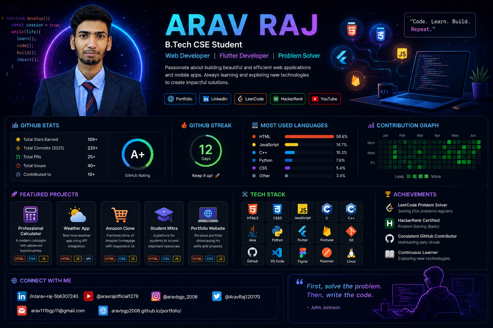

  

  

# Hi 👋, I'm Arav Raj

### 🚀 B.Tech CSE Student | Web Developer | Flutter Learner

* 🎓 B.Tech in Computer Science & Engineering
* 🌱 Currently Learning Flutter, Firebase & Full Stack Development
* 💻 Passionate about Web Development
* 🚀 Building Projects and Improving Problem Solving Skills
* 📫 Reach me at: [arav111bgp11@gmail.com](mailto:arav111bgp11@gmail.com)

## 🌐 Connect With Me

* Portfolio: https://aravbgp2006.github.io/portfolio/
* LinkedIn: http://www.linkedin.com/in/arav-raj-5b6307240
* LeetCode: https://leetcode.com/u/aravbgp2006/
* HackerRank: https://www.hackerrank.com/profile/aravbgp2006
* YouTube: https://www.youtube.com/@aravrajofficial1279
* Instagram: @aravbgp_2006
* Twitter/X: @AravRaj120170

## 🛠️ Tech Stack

HTML • CSS • JavaScript • C • C++ • Java • Python • Git • GitHub • Flutter • Firebase

## 📌 Featured Projects

* 🧮 Professional Calculator
* 🌦️ Weather App
* 🛒 Amazon Clone
* 🎓 Student Mitra
* 🌐 Portfolio Website

## 📊 GitHub Stats

(Stats cards will be added automatically after setup)

⭐ Thanks for visiting my profile!

## 📫 Email

arav111bgp11@gmail.com

## 📊 GitHub Stats

## 🔥 GitHub Streak

## 💻 Most Used Languages

## 🏆 GitHub Trophies

## 💻 Most Used Languages

## 🛠️ Tech Stack

